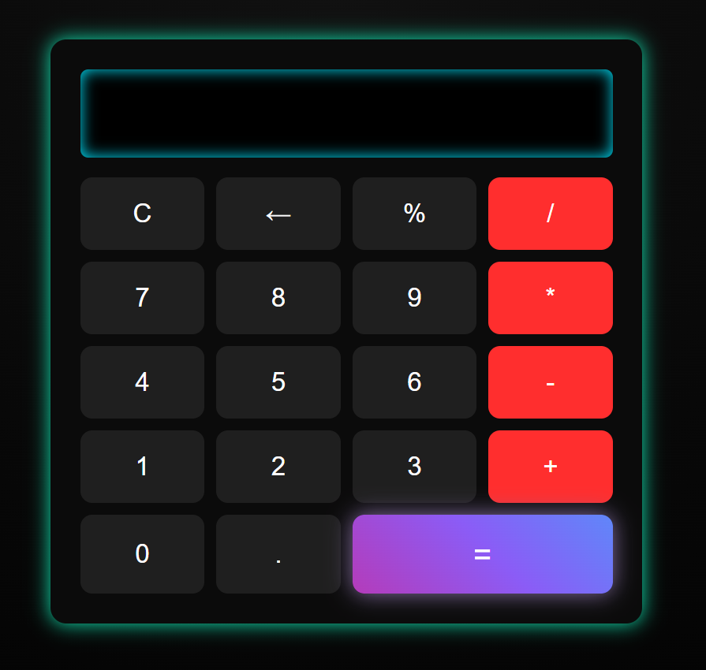

# 🧮 Calculadora Neon

  
  
  

---

Uma **calculadora moderna com visual neon** desenvolvida com **HTML, CSS e JavaScript**, focada em **responsividade**, **animações suaves** e uma interface **futurista / cyberpunk**.

---

## 🎥 Demonstração

---

## 🖼️ Preview

---

## ✨ Funcionalidades

- ➕ Operações básicas (**+ − × ÷**)
- 📊 Cálculo de **porcentagem (%)**
- ⌫ Apagar último dígito
- 🧹 Limpar visor
- 🎨 **Efeito neon (glow)** nos botões
- 🎬 **Animação no botão =**

---

## 🚀 Tecnologias Utilizadas

- **HTML5** – Estrutura
- **CSS3** – Estilização, animações, responsividade e glow neon
- **JavaScript** – Lógica da calculadora

---